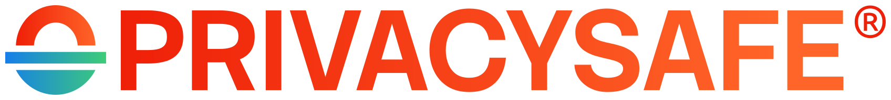

<p align="center">
  <a href="https://privacysafe.app"></a>
</p>

# PrivacySafe Bundles

Published PrivacySafe application bundles, release artifacts, and related distribution information.

## Overview

This repository provides published PrivacySafe bundles and release materials in a simple, inspectable location.

It is intended primarily to provide a source for **Android builds and release artifacts**, including material that can be inspected by users, downstream distributors, and alternative or replacement app stores such as [F-Droid](https://f-droid.org/).

PrivacySafe's canonical Android application ID is:

```text
app.privacysafe
```

PrivacySafe is Free/Libre and Open Source Software (FLOSS). This repository is part of the project's public distribution infrastructure and does not replace the upstream source repositories used to build PrivacySafe.

## Bundles and releases

Published artifacts are stored under [`bundles/`](bundles/).

GitHub Releases may also be used for versioned release artifacts and release metadata.

Where practical, each release should make it easy to identify:

- the PrivacySafe version;
- the target platform;
- the Android ABI or architecture, where applicable;
- the corresponding source revision;
- checksums or other integrity information; and
- information needed by downstream distributors to review the release.

For Android, architecture names should follow Android ABI terminology where applicable, for example:

```text
arm64-v8a
```

See [`SOURCE.md`](SOURCE.md) for the expected bundle-to-source provenance information.

## Android and alternative app stores

One of the primary purposes of this repository is to make PrivacySafe Android release material easy to locate and inspect outside Google Play.

This includes supporting review by alternative app stores and downstream distributors such as [F-Droid](https://f-droid.org/), as well as users who prefer to inspect or obtain PrivacySafe through Free Software distribution channels.

F-Droid and similar projects may build applications from source according to their own reproducibility, metadata, signing, and inclusion requirements. Artifacts published here are therefore release and distribution references; their presence here does not imply acceptance by or publication through any particular third-party app store.

For PrivacySafe nightly Android builds, see:

**https://download.privacysafe.app/nightly/android/**

For the main PrivacySafe project and downloads, see:

**https://privacysafe.app/**

## Source code

PrivacySafe publishes its client and server source code through the PrivacySafe organization:

- [PrivacySafe on GitHub](https://github.com/PrivacySafe)
- [PrivacySafe on Codeberg](https://codeberg.org/PrivacySafe)
- [PrivacySafe website](https://privacysafe.app/)

Relevant platform source includes the [PrivacySafe Android Platform Bundle](https://github.com/PrivacySafe/privacysafe-platform-android-bundle), which packages the PrivacySafe platform and 3NWeb applications for Android distribution.

Release artifacts in this repository should be traceable to the corresponding source wherever practical.

## Integrity and reproducibility

Published release artifacts should be accompanied by checksums or equivalent integrity information when available.

Downstream distributors and users should verify release artifacts before relying on them. Where reproducible-build information is available, it should be published alongside or linked from the relevant release.

This repository must never contain private signing keys, passwords, recovery material, access tokens, or other release secrets.

## 🛡️ Ivy Cyber

[Ivy Cyber](https://ivycyber.com) publishes and supports commercial PrivacySafe offerings, including paid identities, hosting, infrastructure, enterprise deployment, hardware, training, and technical support.

- **[PrivacySafe products and services](https://ivycyber.com)**
- [Shop](https://ivycyber.com/shop/)

Unless a file or component carries a different notice, copyright in original material in this repository is held by **Ivy Cyber LLC**.

## 🏛️ PrivacySafe Foundation

[PrivacySafe Foundation](https://privacysafe.foundation) is a 501(c)(3) nonprofit public charity supporting Free/Libre and Open Source Software (FLOSS), cybersecurity education, decentralized technology, documentation, standards work, and public-interest privacy and security research. The Foundation contributes development work and documentation to PrivacySafe and 3NWeb.

### Support the Foundation

- **[Donate directly to the Foundation](https://privacysafe.foundation)**
- [Open Collective](https://opencollective.com/privacysafe)
- [Ko-fi](https://ko-fi.com/R6R1194HN7)
- [Liberapay](https://liberapay.com/PrivacySafe/donate)

## 💎 3NSoft

[3NSoft, Inc.](https://3nsoft.com) contributes development work and documentation to 3NWeb and PrivacySafe. 3NSoft also provides support and infrastructure, including PrivacySafe identity hosting and download mirrors at [download.privacysafe.app](https://download.privacysafe.app/).

## 🤝 Contributing

Contributions are welcome. Please fork, remix, and submit focused pull requests.

Never send sensitive information about yourself or other users through ordinary direct messages or unencrypted email.

- **Contributor information:** [`CONTRIBUTORS.md`](CONTRIBUTORS.md)
- **Contribution terms:** [`CONTRIBUTING.md`](CONTRIBUTING.md)
- **Contributor Guidelines:** [`CONTRIBUTOR_GUIDELINES.md`](CONTRIBUTOR_GUIDELINES.md)
- **Code of Conduct:** [`CODE_OF_CONDUCT.md`](CODE_OF_CONDUCT.md)
- **AI Contribution Policy:** [`AI_POLICY.md`](AI_POLICY.md)
- **Values:** [`VALUES.md`](VALUES.md)
- **Bugs & Security Issues:** [`SECURITY.md`](SECURITY.md)

### Security reports

Do not publish vulnerability details in a public issue.

Sensitive security reports should be sent to:

`security@privacysafe.net`

The canonical vulnerability disclosure policy, Open Bug Bounty information, GPG fingerprint, scope, safe-harbor terms, and reporting requirements are maintained in [`SECURITY.md`](SECURITY.md). The canonical `security.txt` is published at [privacysafe.app/security.txt](https://privacysafe.app/security.txt).

Ordinary non-security help requests should use `help@privacysafe.net`, as documented in [`SECURITY.md`](SECURITY.md).

## ⚖️ License

© 2026 [Ivy Cyber LLC](https://ivycyber.com/). This project is dedicated to ethical [Free/Libre and Open Source Software (FLOSS)](https://fsf.org/).

Unless otherwise noted, original PrivacySafe software and source materials in this repository are licensed under the [GNU Affero General Public License version 3 or later](LICENSE) (`AGPL-3.0-or-later`).

Third-party software and redistributed artifacts retain their original copyrights and licenses. See [`NOTICE`](NOTICE), [`LICENSES/`](LICENSES/), [`SOURCE.md`](SOURCE.md), and file-level SPDX identifiers for details.

PrivacySafe® and 3NWeb® are registered trademarks. PrivacySafe Foundation™ and Ivy Cyber™ are pending trademarks. Other product, service, technology, and organization names, logos, and marks used in connection with PrivacySafe, 3NWeb, PrivacySafe Foundation, Ivy Cyber, or 3NSoft may also be protected by applicable trademark law. Software licenses do not grant trademark rights or permission to use such marks in a manner that suggests sponsorship, endorsement, affiliation, or origin.
