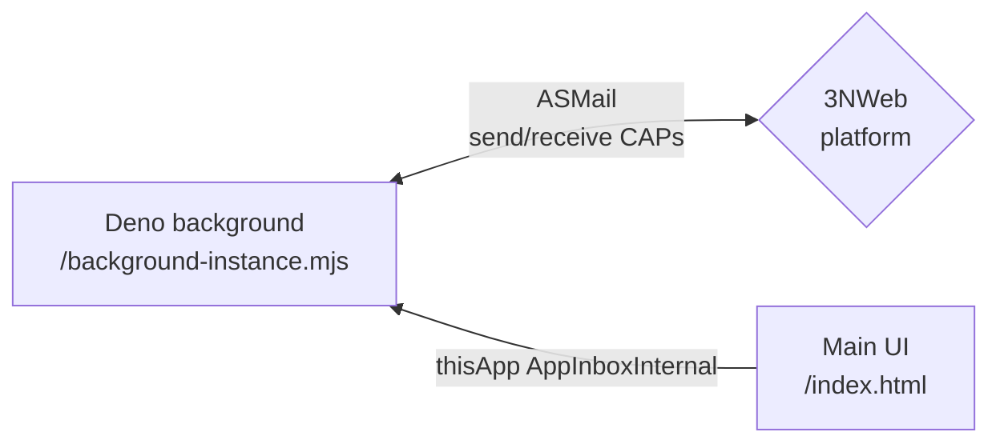
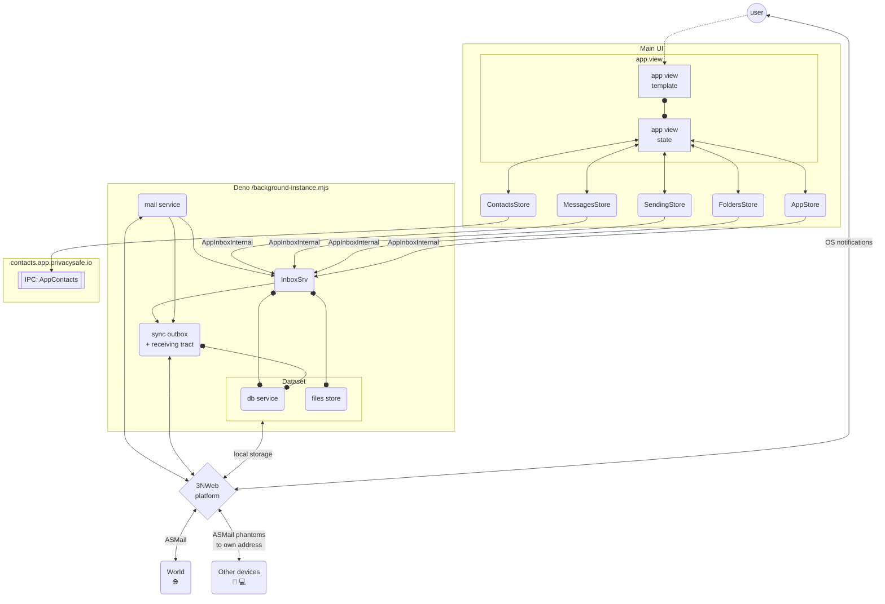

# Implementation

## Components

### Deno background component

Deno starts with the system (`launchOnSystemStartup`) and keeps receiving mail after the window is closed. It owns SQLite (`storage-db`), the labelled file store (`mail-app-files`), ASMail inbox/delivery, and OS notifications.

The database is in the device's **local** file system, so each device has a copy of its own. Those copies converge over ASMail: every local change is announced by a message the device addresses to the user's own address, and conflicts are resolved by last-write-wins per aspect of an entity. See [multi-device-sync.md](./multi-device-sync.md).

#### OS notifications

Deno shows an OS notification only for live mail, i.e. a message that arrives through the inbox subscription and is new to the database. There is no notification for mail found by the startup catch-up scan, for messages applied by multi-device sync or restored from a backup, for a message that is already in the database, or for mail from a blocked sender.

A notification has the sender as its title, the first 50 characters of the subject as its body, and the app logo as its icon. It carries the `open-inbox-msg` command with the message id, so a click opens that message in the UI.

The app keeps **at most one** notification in the OS notification center: the latest one. `replaceSystemNotification()` in [notifications.ts](../src-deno/services/inbox-service/utils/notifications.ts) remembers the id that `addNotification` returned and, before showing the next notification, removes the previous one with `removeNotification(id)`. Chat does the same.

- Calls are serialized. Otherwise two messages arriving almost at once would both remove the same previous notification, and one of the new ones would stay.
- A failed removal is only logged: the user may have already dismissed or clicked that notification. A failed `addNotification` is logged and leaves no id to remove later.
- The id is kept in memory only. After a restart of the Deno component, the notification shown before the restart stays in place.

The removal relies on the platform. At the time of writing, the platform's `removeNotification` resolves without closing anything (core 0.52.3 on macOS), so notifications still pile up there until the platform is fixed. The app needs no change for that.

## Testing (approach, code will follow)

In making tests there is always a tension between scope/usefulness and cost of testing. The best test suite is testing system end to end without any mocks. End to end requires emulation of human that clicks/swipes/scrolls and observes graphics. Although doable with webdrivers, this is costly, and 3NWeb platform is not a usual browser, which we also want to implicitly test by running test app.

Vue's compositional code style creates a nice split in views between "human interaction" and "view's state" parts. We follow convention to name view's state creating functions starting with `use`, like `useAppView()`. Such functions are called in respective `vue` files, and in setups of `tests-app`'s test scenarios for "views' states". Mapping between view state and template is mostly declarative in vue template and it doesn't contain complexity that needs lots of testing. Unless, of course, one goes too crazy with CSS. And even then Vue conditionals for CSS can be coded in view's state, hence, be testable in simpler/cheaper test code without webdriver-like machinery.
